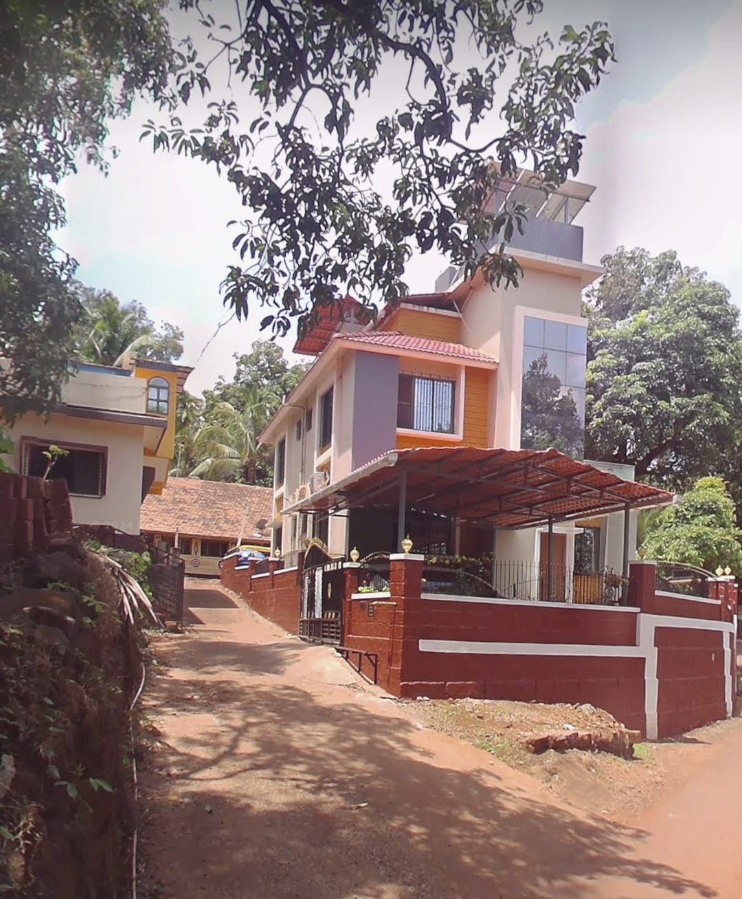
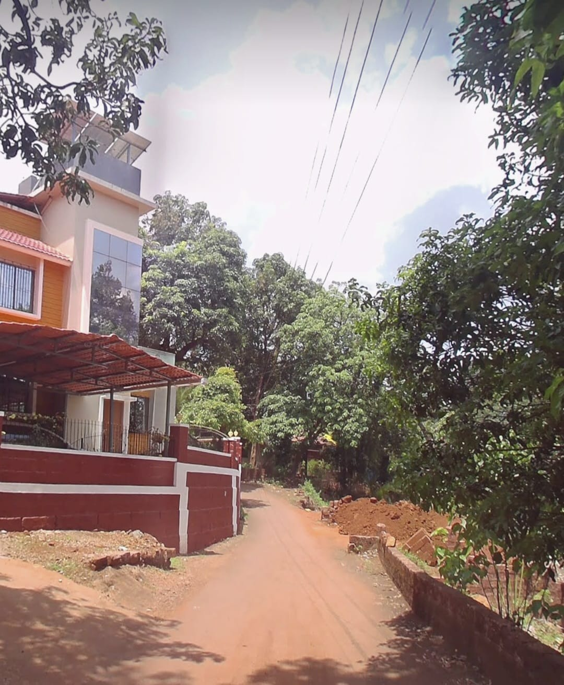
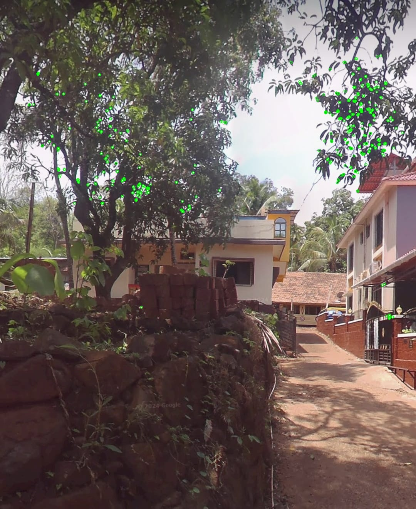
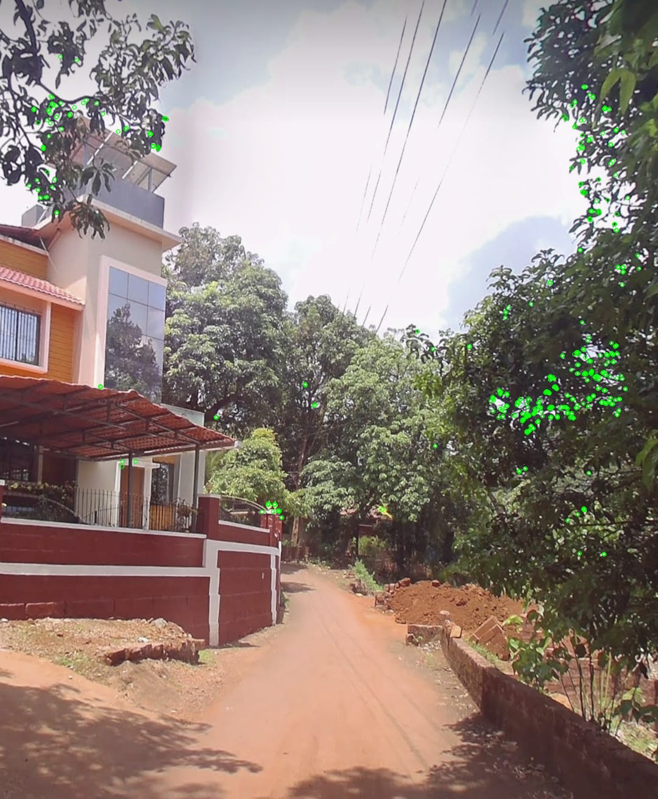
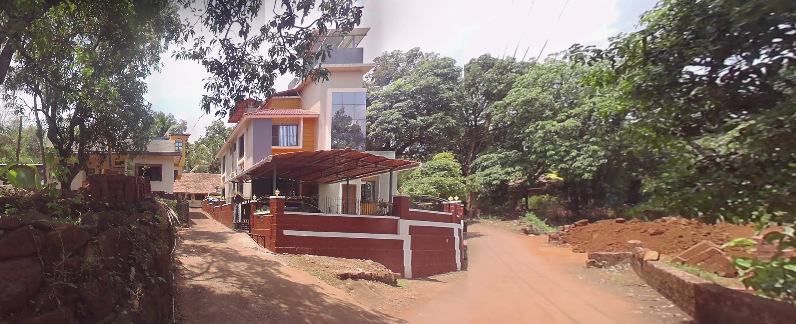

# VR_Assignment1_Saniya-Ismail_IMT2022128

## Overview  
This assignment consists of two parts:  
1. **Coin Detection, Segmentation, and Counting**  
2. **Stitching Images to Create a Panorama**  

### Setup Instructions  
```bash
git clone https://github.com/saniyaismail/VR_Assignment1_Saniya-Ismail_IMT2022128.git
cd VR_Assignment1_Saniya-Ismail_IMT2022128
pip install opencv-python numpy matplotlib
```

# Part A - Coin Detection

### Running the code 
```bash
cd partA
python3 detecting_coins.py
```


## Input Image

- Image : `images/coins.jpeg`

The code can be found at `coin_detection.py`. On running the Python script, it reads the input image from `images/coins.jpeg` and writes the following files as an output to the `output` directory:

- `output/detected_coins.jpg` - Image with detected coins outlined
- `output/threshold.jpg` - Thresholded binary image
- `output/segmented_coin_1.jpg` to `output/segmented_coin_17.jpg` - Individual segmented coins

---

## 1. Image Preprocessing

- **Resizing:** Initially tried resizing the image to a fixed dimension, but it distorted the aspect ratio. Instead, resizing while maintaining aspect ratio worked better for efficient processing.
- **Grayscale Conversion:** Converting the image to grayscale using `cv2.cvtColor` was essential for reducing complexity and improving contrast.
- **Gaussian Blurring:** Applied `cv2.GaussianBlur` to smooth the image and reduce noise. A kernel size of (5,5) worked well, as larger values blurred the edges too much, affecting detection.
- **Adaptive Thresholding:** Tested global thresholding `cv2.threshold` but it struggled with uneven lighting. `cv2.adaptiveThreshold` performed better by dynamically adjusting thresholds based on local regions, leading to clearer object separation.

- Image : `output/threshold.jpg`
---

## 2. Edge Detection and Contour Filtering

- Canny edge detection `cv2.Canny` was tested with different threshold values to identify coin boundaries. Morphological operations like closing `cv2.morphologyEx` with `cv2.MORPH_CLOSE` improved edge connectivity but the result were not that great. 
- Finally, used `cv2.adaptiveThreshold` to enhance coin visibility while suppressing the background. Contours were extracted using `cv2.findContours` and filtered based on circularity (0.7 < circularity < 1.2). This method successfully detected and segmented the coins with higher accuracy
  

- Image : `output/detected_coins.jpg`

---

## 3. Coin Segmentation
- Initially, `cv2.boundingRect` was used to extract rectangular regions, but this included background pixels around the coins, making segmentation less precise. To refine the extraction, circular masks were generated using `cv2.drawContours` isolating only the coin regions. However, in some cases, partial contours led to incomplete masks, resulting in cropped or missing parts of the coins.

- The most effective approach combined `cv2.boundingRect` for defining the region of interest and `cv2.bitwise_and` to apply the mask, ensuring only the coin was extracted while removing unwanted background. This method preserved the circular shape of the coins, improving segmentation accuracy.

### Output Files:
- `output/segmented_coin_1.jpg` to `output/segmented_coin_17.jpg`
-


---

## 4. Coin Counting

- The final count of detected coins was 17, which matched with the expected result.

---
# Part B - Image Stitching

### Running the code
``` bash
cd partB
python3 panorama.py
```

## **The following images were stitched to create a panorama:**


- Images: `images/left.jpeg`

- Images: `images/middle.jpeg`

- Images: `images/right.jpeg`

The code can be found at `panorama_stitching.py`. On running the Python script, it reads 3 overlapping input images from the `images/` directory and writes the following files as an output to the `output/` directory:

- `output/keypoints_left.jpg` - Keypoints detected on `left.jpeg`
- `output/keypoints_middle.jpg` - Keypoints detected on `middle.jpeg`
- `output/keypoints_right.jpg` - Keypoints detected on `right.jpeg`
- `output/panorama.jpg` - Final stitched image

---

## **1. Keypoint Matching**
- Detected keypoints and descriptors using **ORB (Oriented FAST and Rotated BRIEF)** - `cv2.ORB_create()`
- **Brute Force Matcher (BFMatcher)** - `cv2.BFMatcher(cv2.NORM_HAMMING, crossCheck=True)` was used for keypoint matching.
- Keypoints were extracted from each image and matched.
- If fewer than **4 feature matches** were found, homography computation was not performed.
- Tried SIFT + FLANN-Based Matcher, but it did not work well due to incorrect matches and slower performance.

### **Keypoint Matches on Each Image**

- Image: `output/keypoints_left.jpg`

- Image: `output/keypoints_middle.jpg`

- Image: `output/keypoints_right.jpg`

---

## **2. Compute Homography**
- A **homographic transformation** was applied to align the images into the same plane.
- **RANSAC (Random Sample Consensus)** was used to compute the homography matrix from matched keypoints - `cv2.findHomography()`.
- Without **RANSAC**, alignment accuracy was significantly lower.

---

## **3. Stitching the image and Warping**
- The **middle image** was used as the reference image.
- The **right image** was first stitched with the middle image.
- The **left image** was then stitched into the stitched image of the middle and right images.
- **Perspective transformation** was applied using `cv2.warpPerspective()`. Using the cv2.INTER_CUBIC flag (bicubic interpolation) instead of cv2.INTER_LINEAR improved the smoothness of edges and alignment of features after warping. It considers a 4×4 neighborhood of pixels to estimate new pixel values.

---

## **4. Blending Images**
- The overlapping areas were blended to remove visible seams.
- A weighted average was used to create a smooth transition between images.
- After processing all images with the above steps, the final **stitched panorama** was generated.

### **Final Stitched Panorama**

- Image: `output/panorama.jpg`


## Observations:

- Detected the number of coins accurately.
- In cases where there is uneven lighting, some coins may not be detected properly due to inconsistent contour detection.
- Image stitching accuracy depends on the number of keypoints detected and matched between images.
