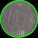

# VR_Assignment1_Saniya-Ismail_IMT2022128

overview :
This assignment consists of two parts 
- coin detection, segementation and counting
- stitching images to create panorama

  git clone https://github.com/saniyaismail/VR_Assignment1_Saniya-Ismail_IMT2022128.git
  cd VR_Assignment1_Saniya-Ismail_IMT2022128
  pip install opencv-python numpy matplotlib

# Part A - Coin Detection

running the code
cd partA
python3 detecting_coins.py

## Input Image

**Path:** `images/coins.jpeg`

The code can be found at `coin_detection.py`. On running the Python script, it reads the input image from `images/coins.jpeg` and writes the following files as an output to the `output` directory:

- `output/detected_coins.jpg` - Image with detected coins outlined
- `output/threshold.jpg` - Thresholded binary image
- `output/segmented_coin_1.jpg` to `output/segmented_coin_17.jpg` - Individual segmented coins

---

## 1. Image Preprocessing

- **Resizing:** The image is resized while maintaining aspect ratio to ensure efficient processing.
- **Grayscale Conversion:** `cv2.cvtColor` is used to convert the image to grayscale.
- **Gaussian Blurring:** `cv2.GaussianBlur` is applied to remove noise and smoothen the image.
- **Adaptive Thresholding:** `cv2.adaptiveThreshold` is used to binarize the image, making object detection easier.

image : `output/threshold.jpg`
---

## 2. Edge Detection and Contour Filtering

- `cv2.findContours` is used to identify object boundaries in the binary image.
- **Circular Contour Filtering:** Contours are filtered based on circularity and area constraints to detect coins accurately.
  

image : `output/detected_coins.jpg`

---

## 3. Coin Segmentation

- **Bounding Boxes:** `cv2.boundingRect` is used to extract rectangular regions containing coins.
- **Masking:** A mask is created for each segmented coin to extract only the relevant portion.
- **Saving Individual Coins:** Each segmented coin is saved separately.

### Output Files:
- `output/segmented_coin_1.jpg` to `output/segmented_coin_17.jpg`
-

---

## 4. Coin Counting

- The total number of coins detected is 17

---
# Part B - Image Stitching

running the code 
cd partB
python3 panorama.py

## **The following images were stitched to create a panorama:**

Images: `images/left.jpeg`, `images/middle.jpeg`, and `images/right.jpeg`

The code can be found at `panorama_stitching.py`. On running the Python script, it reads 3 overlapping input images from the `images/` directory and writes the following files as an output to the `output/` directory:

- `output/keypoints_left.jpg` - Keypoints detected on `left.jpeg`
- `output/keypoints_middle.jpg` - Keypoints detected on `middle.jpeg`
- `output/keypoints_right.jpg` - Keypoints detected on `right.jpeg`
- `output/panorama.jpg` - Final stitched image

---

## **1. Keypoint Matching**
- Detected keypoints and descriptors using **ORB (Oriented FAST and Rotated BRIEF)** - `cv2.ORB_create()`
- **Brute Force Matcher (BFMatcher)** - `cv2.BFMatcher(cv2.NORM_HAMMING, crossCheck=True)` was used for keypoint matching.
- Keypoints were extracted from each image and matched.
- If fewer than **4 feature matches** were found, homography computation was not performed.

### **Keypoint Matches on Each Image**

Image: `output/keypoints_left.jpg`, `output/keypoints_middle.jpg`, `output/keypoints_right.jpg`

---

## **2. Compute Homography**
- A **homographic transformation** was applied to align the images into the same plane.
- **RANSAC (Random Sample Consensus)** was used to compute the homography matrix from matched keypoints - `cv2.findHomography()`.
- Without **RANSAC**, alignment accuracy was significantly lower.

---

## **3. Warping**
- The **middle image** was used as the reference image.
- The **right image** was first warped into the reference image.
- The **left image** was then warped into the stitched image of the middle and right images.
- **Perspective transformation** was applied using `cv2.warpPerspective()`.
- The image was translated to prevent negative pixel values.
- Some **black empty areas** appeared due to perspective transformation.

---

## **4. Blending Images**
- The overlapping areas were blended to remove visible seams.
- A weighted average was used to create a smooth transition between images.
- After processing all images with the above steps, the final **stitched panorama** was generated.

### **Final Stitched Panorama**

Image: `output/panorama.jpg`

## Observations:

- In cases where there is **uneven lighting**, some coins may not be detected properly due to inconsistent contour detection.
